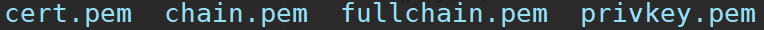

# Devops
## [Docker](docker.md)
## [Jenkins](jenkins.md)

## 配置域名ssl
- 申请域名证书
```shell
# 安装certbot 
sudo apt install certbot 
# certbot certonly --webroot -w [Web站点目录] -d [站点域名] -m [联系人email地址] --agree-tos
sudo certbot certonly --webroot -w /var/www/demo -d demo.com -m demo@gmail.com --agree-tos
```
```shell
# 申请成功后，会在 /etc/letsencrypt/live/{域名}/ 下生成证书文件
ls /etc/letsencrypt/live/demo.com 
```

```shell
# 查看证书有效期
openssl x509 -noout -dates -in /etc/letsencrypt/live/{域名}/cert.pem
```
- 配置nginx
```text
ssl_certificate    /etc/letsencrypt/live/{域名}/fullchain.pem;
ssl_certificate_key    /etc/letsencrypt/live/{域名}/privkey.pem;
```
- 设置自动续签
```shell
crontab -e
# 加入命令
0 10 * * 1 certbot renew --quiet && nginx -s reload
```